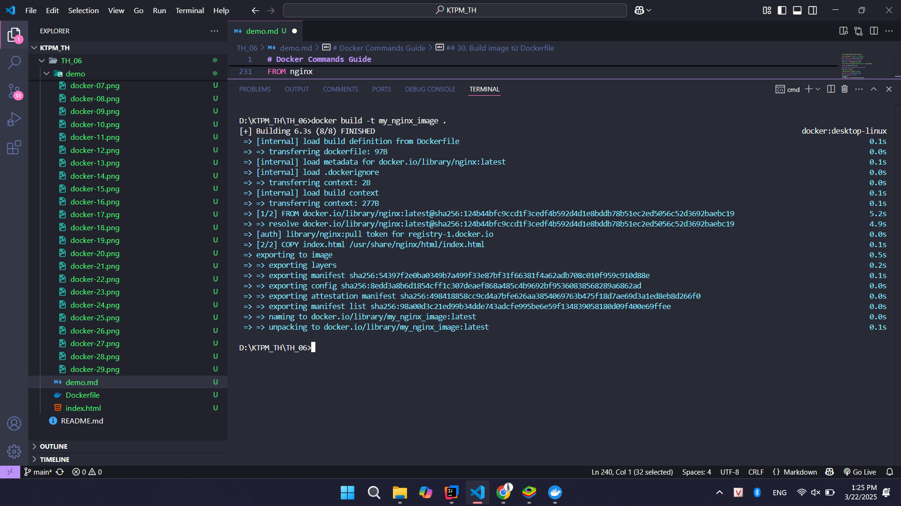

# Docker Commands Guide

Dưới đây là danh sách các lệnh Docker phổ biến kèm theo giải thích ngắn gọn và vị trí để chèn hình ảnh minh chứng.

## 1. Kiểm tra phiên bản Docker
```sh
docker --version
```
> Kiểm tra phiên bản Docker đang cài đặt.


## 2. Chạy container thử nghiệm
```sh
docker run hello-world
```
> Kiểm tra xem Docker có hoạt động đúng không bằng cách chạy container mẫu.


## 3. Tải về image Nginx
```sh
docker pull nginx
```
> Tải image Nginx từ Docker Hub.


## 4. Danh sách images đã tải về
```sh
docker images
```
> Hiển thị danh sách các images hiện có trên máy.


## 5. Chạy container từ image Nginx
```sh
docker run -d nginx
```
> Chạy một container từ image Nginx ở chế độ nền.


## 6. Liệt kê container đang chạy
```sh
docker ps
```
> Hiển thị danh sách các container đang chạy.


## 7. Liệt kê tất cả container (bao gồm cả container đã dừng)
```sh
docker ps -a
```
> Hiển thị danh sách tất cả các container.


## 8. Xem logs của container
```sh
docker logs <container_id>
```
> Hiển thị logs của container cụ thể.


## 9. Truy cập vào container
```sh
docker exec -it <container_id> /bin/sh
```
> Mở terminal bên trong container.


## 10. Dừng container
```sh
docker stop <container_id>
```
> Dừng container đang chạy.


## 11. Khởi động lại container
```sh
docker restart <container_id>
```
> Khởi động lại container.


## 12. Xóa container
```sh
docker rm <container_id>
```
> Xóa container (phải dừng trước khi xóa).


## 13. Xóa tất cả container đã dừng
```sh
docker container prune
```
> Xóa tất cả container không còn hoạt động.


## 14. Xóa image
```sh
docker rmi <image_id>
```
> Xóa một image cụ thể.


## 15. Xóa tất cả images không sử dụng
```sh
docker image prune -a
```
> Xóa tất cả images không còn được sử dụng.


## 16. Chạy container với port mapping
```sh
docker run -d -p 8080:80 nginx
```
> Chạy container Nginx và ánh xạ cổng 8080 của máy chủ với cổng 80 của container.


## 17. Kiểm tra thông tin container
```sh
docker inspect <container_id>
```
> Hiển thị thông tin chi tiết về container.


## 18. Tạo volume và gắn vào container
```sh
docker run -d -v mydata:/data nginx
```
> Tạo volume `mydata` và gắn vào thư mục `/data` trong container.


## 19. Danh sách volumes
```sh
docker volume ls
```
> Hiển thị danh sách các volumes.


## 20. Xóa tất cả volumes không sử dụng
```sh
docker volume prune
```
> Xóa tất cả volumes không còn sử dụng.


## 21. Chạy container với tên cụ thể
```sh
docker run -d --name my_nginx nginx
```
> Chạy container Nginx với tên `my_nginx`.


## 22. Theo dõi tài nguyên container
```sh
docker stats
```
> Hiển thị tài nguyên CPU, RAM mà container đang sử dụng.


## 23. Danh sách networks trong Docker
```sh
docker network ls
```
> Hiển thị danh sách các networks hiện có.


## 24. Tạo network
```sh
docker network create my_network
```
> Tạo một network mới có tên `my_network`.


## 25. Chạy container trong network
```sh
docker run -d --network my_network --name my_container nginx
```
> Chạy container và kết nối vào `my_network`.


## 26. Kết nối container vào network
```sh
docker network connect my_network my_nginx
```
> Kết nối container `my_nginx` vào `my_network`.


## 27. Chạy container với biến môi trường
```sh
docker run -d -e MY_ENV=hello_world nginx
```
> Thiết lập biến môi trường `MY_ENV=hello_world` trong container.


## 28. Theo dõi logs container theo thời gian thực
```sh
docker logs -f my_nginx
```
> Theo dõi logs của container `my_nginx`.


## 29. Viết Dockerfile cho Nginx
```dockerfile
FROM nginx
COPY index.html /usr/share/nginx/html/index.html
```
> Tạo Dockerfile để build image tùy chỉnh với file `index.html`.


## 30. Build image từ Dockerfile
```sh
docker build -t my_nginx_image .
```
> Build image từ Dockerfile với tên `my_nginx_image`.



## 31. Chạy container từ image tùy chỉnh
```sh
docker run -d -p 8080:80 my_nginx_image
```
> Chạy container từ image `my_nginx_image` và ánh xạ cổng.


